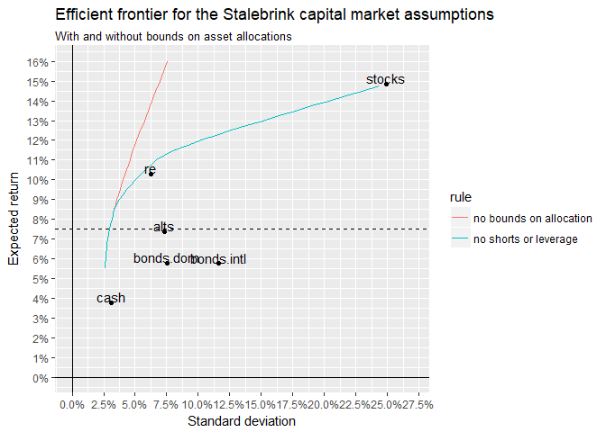

<!-- README.md is generated from README.Rmd. Please edit that file -->

# portopt

Tools for simple portfolio optimization:

  - Minimum variance portfolio for a given expected return, with no
    limits on allocations for individual asset classes other than that
    they must sum to 1. (That is, shorting and leverage are allowed.)

  - Minimum variance portfolio with lower and upper bounds on
    allocations for asset classes. It can also accommodate more-general
    linear constraints on asset classes. (For example, stocks plus bonds
    combined must be between 40% and 60% of the portfolio.)

  - Efficient frontier

`portopt` cannot handle nonlinear constraints on asset allocations, and
it cannot find an optimal portfolio that satisfies more-complex
objectives, such as value-at-risk criteria. For my purposes, so far,
these are not necessary. `portopt` uses `solve.QP` from the package
`quadprog` for minimum-variance optimization. Other solvers would be
required for more-complex optimization.

I wrote `portopt` because I was looking for basic portfolio optimization
tools in `R`. There are many available packages, but the package that
looked like it would be most useful, `PortfolioAnalytics`, recently was
removed from `CRAN` although I have installed it from github. It seems
very powerful. `fPortfolio` also seems powerful. I understand the basics
of how to use them when we are starting with raw data - historical data
on asset returns - but I haven’t figured out how to use them when we
only want to use summary measures to construct an efficient frontier, by
using already-available expected returns and standard deviations by
asset classs, plus the correlation matrix. I am sure
`PortfolioAnalytics` and `fPortfolio` can do that but I haven’t figured
it out. At some point I may abandon this package in favor of one of
these two packages.

## portopt data sets

`portopt` includes several data sets, each with expected returns,
standard deviations, and a correlation matrix for multiple asset
classes. These data sets are used in the examples below. Each data set
is a list with two elements:

  - `ersd` - a data frame with columns class (the asset class), er
    (expected return), and sd (standard deviation)
  - `cormat` - a correlation matrix for these assets. Thus, the number
    of rows and number of columns equal the number of asset classes. The
    row names and column names are the asset-class names.

The data sets and their respective sources are:

  - `stalebrink` – Stalebrink, O. J. “Public Pension Funds and Assumed
    Rates of Return: An Empirical Examination of Public Sector Defined
    Benefit Pension Plans.” The American Review of Public Administration
    44, no. 1 (January 1, 2014): 92–111.
    <https://doi.org/10.1177/0275074012458826>.

  - `rvk` – RVK. “Asset/Liability Study: Los Angeles Fire and Police
    Pension System.” RVK, Inc., October 2015.

  - `horizon10year2017` – “Survey of Capital Market Assumptions: 2017
    Edition.” Horizon Actuarial Services, LLC, August 2017.
    <http://www.horizonactuarial.com/uploads/3/0/4/9/30499196/horizon_cma_survey_2017_v0822.pdf>.

The associated documents are in the “docs” folder of this project, on
the github site

The examples below use these datasets.

## Installation

Install as follows:

``` r
devtools::install_github("donboyd5/portopt")
```

## Examples

### Get basic information about a dataset

``` r
library("portopt")
library("plyr")
library("magrittr")
library("Matrix")
library("quadprog")
library("tidyverse")

stalebrink
#> $ersd
#> # A tibble: 6 x 3
#>   class          er     sd
#>   <chr>       <dbl>  <dbl>
#> 1 stocks     0.148  0.249 
#> 2 bonds.dom  0.058  0.0751
#> 3 bonds.intl 0.0577 0.116 
#> 4 re         0.103  0.0626
#> 5 alts       0.0738 0.0734
#> 6 cash       0.0377 0.0308
#> 
#> $cormat
#>            stocks bonds.dom bonds.intl    re  alts  cash
#> stocks       1.00      0.05       0.22  0.05  0.13 -0.08
#> bonds.dom    0.05      1.00       0.42 -0.28 -0.04  0.29
#> bonds.intl   0.22      0.42       1.00 -0.37 -0.04  0.22
#> re           0.05     -0.28      -0.37  1.00 -0.06  0.33
#> alts         0.13     -0.04      -0.04 -0.06  1.00 -0.10
#> cash        -0.08      0.29       0.22  0.33 -0.10  1.00
aa.wts <- c(.25, .25, .2, .15, .1, .05) # asset-allocation weights
per(stalebrink$ersd$er, aa.wts) # portfolio expected return with these weights
#> [1] 0.08788
psd(stalebrink$cormat, stalebrink$ersd$sd, aa.wts) # portfolio standard deviation with these weights
#> [1] 0.07708479
```

### Get the minimum variance portfolio for a given expected return

``` r
# Create several minimum-variance portfolios

# no restrictions on asset allocation - shorting and leverage allowed
minvport(.09, stalebrink$ersd, stalebrink$cormat)$portfolio
#> # A tibble: 6 x 7
#>   class          er     sd er.target asset.weight   per    psd
#>   <chr>       <dbl>  <dbl>     <dbl>        <dbl> <dbl>  <dbl>
#> 1 stocks     0.148  0.249       0.09      0.00276  0.09 0.0356
#> 2 bonds.dom  0.058  0.0751      0.09      0.209    0.09 0.0356
#> 3 bonds.intl 0.0577 0.116       0.09      0.123    0.09 0.0356
#> 4 re         0.103  0.0626      0.09      0.569    0.09 0.0356
#> 5 alts       0.0738 0.0734      0.09      0.226    0.09 0.0356
#> 6 cash       0.0377 0.0308      0.09     -0.130    0.09 0.0356

# shorting and leverage NOT allowed:
minvport(.09, stalebrink$ersd, stalebrink$cormat, 0, 1)$portfolio
#> # A tibble: 6 x 7
#>   class          er     sd er.target asset.weight   per    psd
#>   <chr>       <dbl>  <dbl>     <dbl>        <dbl> <dbl>  <dbl>
#> 1 stocks     0.148  0.249       0.09       0.0323  0.09 0.0374
#> 2 bonds.dom  0.058  0.0751      0.09       0.119   0.09 0.0374
#> 3 bonds.intl 0.0577 0.116       0.09       0.0886  0.09 0.0374
#> 4 re         0.103  0.0626      0.09       0.585   0.09 0.0374
#> 5 alts       0.0738 0.0734      0.09       0.175   0.09 0.0374
#> 6 cash       0.0377 0.0308      0.09       0       0.09 0.0374

# shorting and leverage NOT allowed, 40% upper bound on real estate:
minvport(.09, stalebrink$ersd, stalebrink$cormat, 0, c(1, 1, 1, .4, 1, 1))$portfolio
#> # A tibble: 6 x 7
#>   class          er     sd er.target asset.weight   per    psd
#>   <chr>       <dbl>  <dbl>     <dbl>        <dbl> <dbl>  <dbl>
#> 1 stocks     0.148  0.249       0.09       0.101   0.09 0.0437
#> 2 bonds.dom  0.058  0.0751      0.09       0.157   0.09 0.0437
#> 3 bonds.intl 0.0577 0.116       0.09       0.0330  0.09 0.0437
#> 4 re         0.103  0.0626      0.09       0.40    0.09 0.0437
#> 5 alts       0.0738 0.0734      0.09       0.310   0.09 0.0437
#> 6 cash       0.0377 0.0308      0.09       0       0.09 0.0437
```

### Check whether correlation matrix is positive definite

While it can be fixed, the differences between the original and adjusted
correlation matrices can be large. This requires investigation.

``` r
is.PD(stalebrink$cormat) # good
#> [1] TRUE

is.PD(rvk$cormat) # bad
#> [1] FALSE
cormat2 <- makePDcorr(rvk$cormat)
is.PD(cormat2)
#> [1] TRUE
# compare:
rvk$cormat %>% round(., 2)
#>                  stocks.us stocks.intl fixed fi.tips fi.yield
#> stocks.us             1.00        0.48  0.10   -0.06    -0.38
#> stocks.intl           0.48        1.00  1.52    0.58     0.18
#> fixed                 0.10        1.52  1.00    0.58     0.42
#> fi.tips              -0.06        0.58  0.58    1.00     1.54
#> fi.yield             -0.38        0.18  0.42    1.54     1.00
#> fi.unconstrained      0.02        0.32  0.06    1.24     1.42
#> re                   -0.14        0.00  0.28    1.38     1.54
#> pe                    0.00       -0.12  0.06    1.06     0.66
#> commodities           0.08       -0.56 -0.10    1.06     0.96
#> cash                  0.16        0.06  0.58    0.72     1.16
#>                  fi.unconstrained    re    pe commodities cash
#> stocks.us                    0.02 -0.14  0.00        0.08 0.16
#> stocks.intl                  0.32  0.00 -0.12       -0.56 0.06
#> fixed                        0.06  0.28  0.06       -0.10 0.58
#> fi.tips                      1.24  1.38  1.06        1.06 0.72
#> fi.yield                     1.42  1.54  0.66        0.96 1.16
#> fi.unconstrained             1.00  1.68  0.48        1.52 0.66
#> re                           1.68  1.00  0.60        1.50 1.02
#> pe                           0.48  0.60  1.00        1.48 0.68
#> commodities                  1.52  1.50  1.48        1.00 0.96
#> cash                         0.66  1.02  0.68        0.96 1.00
cormat2 %>% round(., 2)
#> 10 x 10 Matrix of class "dpoMatrix"
#>                  stocks.us stocks.intl fixed fi.tips fi.yield
#> stocks.us             1.00        0.33  0.19   -0.05    -0.17
#> stocks.intl           0.33        1.00  0.97    0.29     0.17
#> fixed                 0.19        0.97  1.00    0.46     0.36
#> fi.tips              -0.05        0.29  0.46    1.00     0.98
#> fi.yield             -0.17        0.17  0.36    0.98     1.00
#> fi.unconstrained     -0.07        0.11  0.27    0.97     0.98
#> re                   -0.11        0.08  0.26    0.97     0.99
#> pe                    0.02       -0.14  0.01    0.79     0.76
#> commodities          -0.06       -0.17  0.00    0.88     0.90
#> cash                  0.09        0.20  0.39    0.88     0.90
#>                  fi.unconstrained    re    pe commodities cash
#> stocks.us                   -0.07 -0.11  0.02       -0.06 0.09
#> stocks.intl                  0.11  0.08 -0.14       -0.17 0.20
#> fixed                        0.27  0.26  0.01        0.00 0.39
#> fi.tips                      0.97  0.97  0.79        0.88 0.88
#> fi.yield                     0.98  0.99  0.76        0.90 0.90
#> fi.unconstrained             1.00  1.00  0.78        0.94 0.87
#> re                           1.00  1.00  0.80        0.95 0.90
#> pe                           0.78  0.80  1.00        0.91 0.71
#> commodities                  0.94  0.95  0.91        1.00 0.84
#> cash                         0.87  0.90  0.71        0.84 1.00
(cormat2 - rvk$cormat) %>% round(., 2)
#> 10 x 10 Matrix of class "dsyMatrix"
#>                  stocks.us stocks.intl fixed fi.tips fi.yield
#> stocks.us             0.00       -0.15  0.09    0.01     0.21
#> stocks.intl          -0.15        0.00 -0.55   -0.29    -0.01
#> fixed                 0.09       -0.55  0.00   -0.12    -0.06
#> fi.tips               0.01       -0.29 -0.12    0.00    -0.56
#> fi.yield              0.21       -0.01 -0.06   -0.56     0.00
#> fi.unconstrained     -0.09       -0.21  0.21   -0.27    -0.44
#> re                    0.03        0.08 -0.02   -0.41    -0.55
#> pe                    0.02       -0.02 -0.05   -0.27     0.10
#> commodities          -0.14        0.39  0.10   -0.18    -0.06
#> cash                 -0.07        0.14 -0.19    0.16    -0.26
#>                  fi.unconstrained    re    pe commodities  cash
#> stocks.us                   -0.09  0.03  0.02       -0.14 -0.07
#> stocks.intl                 -0.21  0.08 -0.02        0.39  0.14
#> fixed                        0.21 -0.02 -0.05        0.10 -0.19
#> fi.tips                     -0.27 -0.41 -0.27       -0.18  0.16
#> fi.yield                    -0.44 -0.55  0.10       -0.06 -0.26
#> fi.unconstrained             0.00 -0.68  0.30       -0.58  0.21
#> re                          -0.68  0.00  0.20       -0.55 -0.12
#> pe                           0.30  0.20  0.00       -0.57  0.03
#> commodities                 -0.58 -0.55 -0.57        0.00 -0.12
#> cash                         0.21 -0.12  0.03       -0.12  0.00
```

### Get and graph the efficient frontier for Stalebrink assumptions

``` r

ds <- stalebrink

ef.nobound <- efrontier(seq(.00, .30, .0025), ds$ersd, ds$cormat)
ef.noshort <- efrontier(seq(.00, .30, .0025), ds$ersd, ds$cormat, 0, 1)

# create a data frame with just the data we want
efdf <- bind_rows(ef.nobound$efrontier %>% mutate(rule="no bounds on allocation"),
                  ef.noshort$efrontier %>% mutate(rule="no shorts or leverage")) %>%
  filter(type=="high", !is.na(per))

ggplot() +
  geom_line(data=efdf, aes(psd, per, colour=rule)) +
  scale_x_continuous(name="Standard deviation", breaks=seq(0, .5, .025), limits=c(0, .27), labels = scales::percent) +
  scale_y_continuous(name="Expected return", breaks=seq(0, .5, .01), limits=c(0, .16), labels = scales::percent) +
  ggtitle("Efficient frontier for the Stalebrink capital market assumptions", subtitle="With and without bounds on asset allocations") +
  # now add the asset-class points
  geom_point(data=ef.nobound$ersd, aes(x=sd, y=er)) +
  geom_text(data=ef.nobound$ersd, aes(x=sd, y=er, label=class), nudge_y = +.003) +
  geom_hline(yintercept = 0) +
  geom_vline(xintercept = 0) +
  geom_hline(yintercept = .075, linetype="dashed")
#> Warning: Removed 56 rows containing missing values (geom_path).
```



### Repeat for the Horizon 2017 10-year assumptions

``` r

ds <- horizon10year2017

ef.nobound <- efrontier(seq(.00, .30, .0025), ds$ersd, ds$cormat)
ef.noshort <- efrontier(seq(.00, .30, .0025), ds$ersd, ds$cormat, 0, 1)

# create a data frame with just the data we want
efdf <- bind_rows(ef.nobound$efrontier %>% mutate(rule="no bounds on allocation"),
                  ef.noshort$efrontier %>% mutate(rule="no shorts or leverage")) %>%
  filter(type=="high", !is.na(per))

ggplot() +
  geom_line(data=efdf, aes(psd, per, colour=rule)) +
  scale_x_continuous(name="Standard deviation", breaks=seq(0, .5, .025), limits=c(0, .27), labels = scales::percent) +
  scale_y_continuous(name="Expected return", breaks=seq(0, .5, .01), limits=c(0, .16), labels = scales::percent) +
  ggtitle("Efficient frontier for the Horizon 2017 average 10-year capital market assumptions", subtitle="With and without bounds on asset allocations") +
  # now add the asset-class points
  geom_point(data=ef.nobound$ersd, aes(x=sd, y=er)) +
  geom_text(data=ef.nobound$ersd, aes(x=sd, y=er, label=class), nudge_y = +.003) +
  geom_hline(yintercept = 0) +
  geom_vline(xintercept = 0) +
  geom_hline(yintercept = .075, linetype="dashed")
#> Warning: Removed 57 rows containing missing values (geom_path).
```


### Asset weights for the Stalebrink assumtions

``` r
ds <- stalebrink

ef.nobound <- efrontier(seq(.00, .30, .0025), ds$ersd, ds$cormat)
ef.noshort <- efrontier(seq(.00, .30, .0025), ds$ersd, ds$cormat, 0, 1)

# Examine asset class weights for different classes
ef.noshort$weights %>%
  filter(class %in% c("stocks", "cash", "bonds.dom")) %>%
  ggplot(aes(er.target, asset.weight, colour=class)) +
  geom_line() +
  ggtitle("Stalebrink weights with no shorting or leverage")
#> Warning: Removed 231 rows containing missing values (geom_path).
```


``` r

# Compare weights for an asset class, optimized with and without bounds
aclass <- "stocks"
wts <- bind_rows(ef.nobound$weights %>% mutate(rule="no bounds on allocation"),
                 ef.noshort$weights %>% mutate(rule="no shorts or leverage")) %>%
       filter(class==aclass)
     
wts %>%
       ggplot(aes(er.target, asset.weight, colour=rule)) +
       geom_line() +
       geom_hline(yintercept=0) +
       scale_x_continuous(breaks=seq(0, 1, .05)) +
       ggtitle(paste0(aclass, " weights, Stalebrink assumptions"))
#> Warning: Removed 77 rows containing missing values (geom_path).
```


